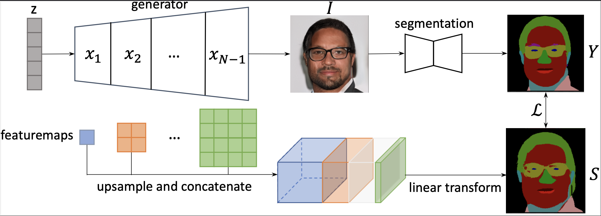

# Linear Semantics of Generative Adversarial Networks

This repo aims to introduce a discovery: linear transformations suffice to extract semantics from the generator's feature maps. In other words, the semantic mask corresponding to the generated image can be extracted from the generator's feature maps using `linear transformations`, which we abbreviate as the Linear Semantic Extractor (LSE). We verify this claim by comparing LSE to two nonlinear extraction methods, called Nonlinear Semantic Extractors (NSEs). It is found that the performance drop of the LSE relative to NSEs is negligible (less than 5%) in most cases.

The discovering of GAN's linear semantic encoding allows the `few-shot` learning of LSE. Using 8 annotations, the few-shot LSE can match 70% performance of its fully supervised version. The few-shot LSE can enable semantic controllable image synthesis on GANs in few-shot settings. To be specific, we propose few-shot Semantic-Precise Image Editing and few-shot Semantic Conditional Synthesis. The few-shot SPIE means to edit the semantic layout of a generated image with a few annotations. The few-shot SCS refers to sample images matching a semantic mask target with the help of a few annotations.

## Overview

The pipeline of the Linear Semantic Extractor is shown below.



## Installation

1. We highly recommend using `conda` to install `pytorch`. `conda install torch torchvision`.

2. Install other prerequisites. `pip3 install -r requirements.txt`

3. Install [torch-encoding](https://github.com/zhanghang1989/PyTorch-Encoding). `pip3 install git+https://github.com/zhanghang1989/PyTorch-Encoding`.

Folder structure:

```
`- data # Download this folder according to step 4
| `- MaskCelebAHQ # for SCS on StyleGAN2-FFHQ
| `- trunc_stylegan2_bedroom # for SCS on StyleGAN2-Bedroom
| `- trunc_stylegan2_church # for SCS on StyleGAN2-Church
| `- collect_ffhq # for SIE
`- figure # for creating the figures in paper
`- home # part of the web application
`- expr
`- models
| `- pretrain
|   `- pytorch # Download generators here
`- predictors
  `- pretrain
    `- faceparse_unet_512.pth # Download
```


## Common issues

1. If `pytorch-lightning` is giving too much warning like `You have set 17 number of classes which is different from predicted (15) and target (15) number of classes` below, you can disable them using `python -W ignore your_script.py`.

## Acknowledgement

This work is built upon the following repos:

GenForce
MaskGAN