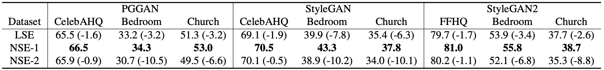
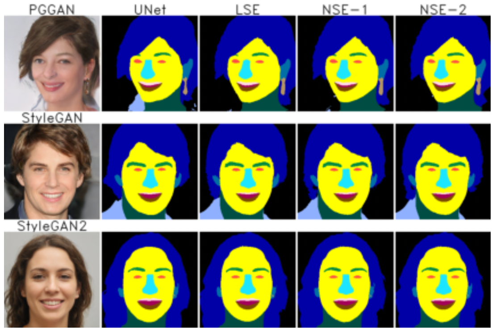
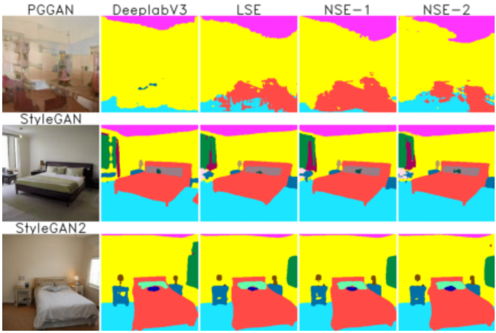
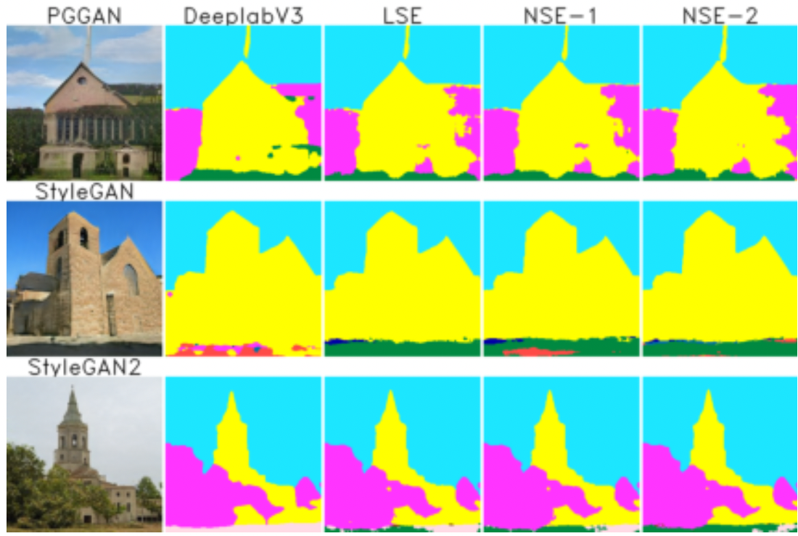
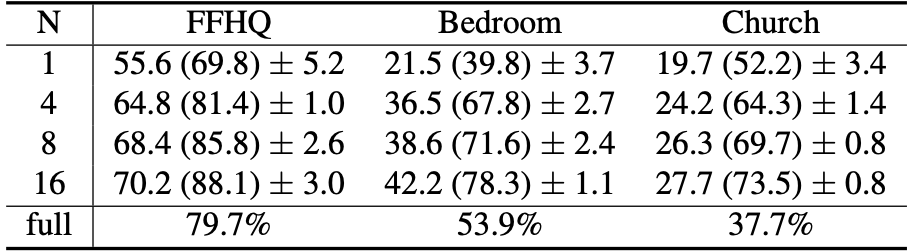
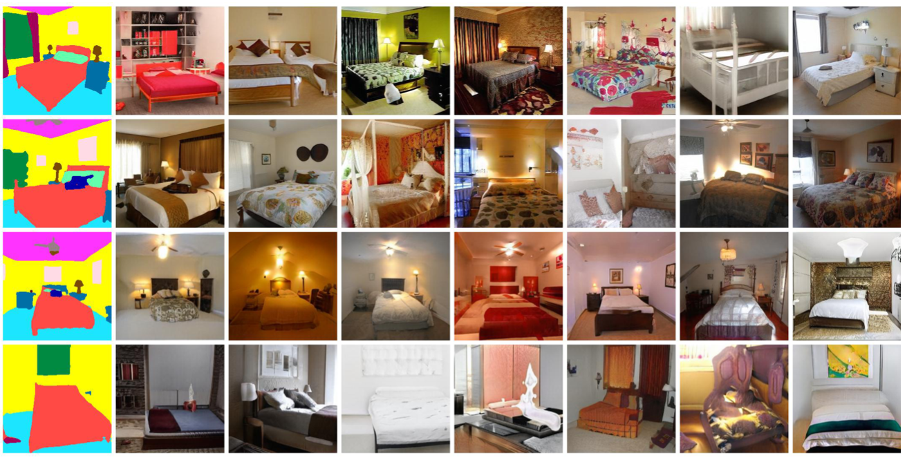

# Linear Semantics of Generative Adversarial Networks

## [Project Page](https://atlantixjj.github.io/LinearSemanticsGAN/) | [Paper](https://arxiv.org/abs/2104.00487) | [Download](https://drive.google.com/drive/folders/1e66ooGzbKZLoXoy7Up31U-ibCBjrNW9l?usp=sharing)


[Linear Semantics of Generative Adversarial Networks](https://arxiv.org/abs/2104.00487)

[Jianjin Xu](https://atlantixjj.github.io/)<sup>1,2</sup>, [Changxi Zheng](http://www.cs.columbia.edu/~cxz/)<sup>1</sup>


<sup>1</sup>Columbia University, <sup>2</sup>Panzhihua Univeristy

In CVPR 2021.

## Abstract

Generative Adversarial Networks (GANs) are able to generate high-quality images, but it remains difficult to explicitly specify the semantics of synthesized images. In this work, we aim to better understand the semantic representation of GANs, and thereby enable semantic control in GAN's generation process. Interestingly, we find that a well-trained GAN encodes image semantics in its internal feature maps in a surprisingly simple way: a linear transformation of feature maps suffices to extract the generated image semantics.

To verify this simplicity, we conduct extensive experiments on various GANs and datasets; and thanks to this simplicity, we are able to learn a semantic segmentation model for a trained GAN from a small number (e.g., 8) of labeled images. Last but not least, leveraging our findings, we propose two few-shot image editing approaches, namely Semantic-Conditional Sampling and Semantic Image Editing. Given a trained GAN and as few as eight semantic annotations, the user is able to generate diverse images subject to a user-provided semantic layout, and control the synthesized image semantics.

## Installation

1. We highly recommend using `conda` to install `pytorch`. `conda install torch torchvision`.

2. Install other prerequisites. `pip3 install -r requirements.txt`

3. Install [torch-encoding](https://github.com/zhanghang1989/PyTorch-Encoding). `pip3 install git+https://github.com/zhanghang1989/PyTorch-Encoding`.

4. Download the pretrained generators, test data from [Google Drive](https://drive.google.com/drive/folders/1e66ooGzbKZLoXoy7Up31U-ibCBjrNW9l?usp=sharing). Optionally, you can download the trained models in the paper.

Folder structure:

```
`- data # Download this folder according to step 4
| `- MaskCelebAHQ # for SCS on StyleGAN2-FFHQ
| `- trunc_stylegan2_bedroom # for SCS on StyleGAN2-Bedroom
| `- trunc_stylegan2_church # for SCS on StyleGAN2-Church
| `- collect_ffhq # for SIE
`- figure # for creating the figures in paper
`- home # part of the web application
`- expr
`- models
| `- pretrain
|   `- pytorch # Download pretrained generators here
`- predictors
  `- pretrain # Download pretrained predictors here
```


## Reproduce results in the paper

Our results are obtained on a wide range of GAN models and datasets with reproduciable setups.

### Comparison of LSE, NSE-1, and NSE-2

1. Train LSE, NSE-1, and NSE-2 for all the GAN models.

```bash
mkdir -p expr/semantics # Default experiment path
mkdir -p results/semantics # To store results
python submit.py --func sr_all_method
```

After running the command above, you are expected to get dozens of models in `expr/semantics/` folder, and their evaluation results in `results/semantics` as `txt` files.

The category list for each GAN is stored at `figure/selected_labels.csv`.

2. Collect results.

```bash
mkdir -p results/tex # Default table output path
python figure/SE_eval.py
```

After running the script, you are expected to get a latex table named `SE.tex` in `results/tex` folder for the evaluation of all the results. Besides, there are files named as `SE_{G_name}.tex` for each GAN model showing category-wise evaluation results.

3. For your reference, the evaluation results should be close to ours shown below:



4. You can visualize the segmentation by running `python figure/qualitative_paper.py --op <face, bedroom, or church>`. Our results are:

| Face dataset | Bedroom dataset | Church dataset|
|:--|:--|:--|
||||

5. You can see if the model converges by running `python figure/train_evaluation.py`. This script will generate the evolution plot of training mIoU, similar to the one shown in the appendix of our paper.

## Few-shot learning of LSE

1. Train all the few-shot LSEs for StyleGAN2 models using the following command:

```bash
mkdir -p expr/fewshot
python submit.py --func train_fewshot
```

This will repeat each training for 5 times with different training dataset to account for the large data variance in few-shot learning.
You should expect three folders named like `{G_name}_LSE_fewshot`, each containing LSE models with different numebrs of training samples and index of training repeat.

2. Collect the results.

```bash
mkdir -p results/fewshot # default results location
python figure/fewshot_compare.py
```

The result files will have the same format as the evaluation of fully trained models.

3. We obtained the results that the few-shot LSEs achieve pretty good performance comparing to their fully trained counterpart, as shown below.

<center></center>

## Few-shot Semantic Conditional Sampling

1. After trained the few-shot LSEs, run:

```bash
mkdir -p results/scs
python submit.py --func scs
```

This will evaluate SCS on 100 semantic targets, where each target is used to sample 10 images.
Sampled latent vectors are stored to `results/scs` as `pth` files.

2. Visualize the sample results by running `python figure/fewshot_scs.py`. This will visualize the results stored in `results/scs` and save them into the same directory. Our results of SCS(8-shot LSE) for bedroom images are:



## Few-shot Semantic Image Editing

You can edit any generated images using our web interface.
The editing results are shown in a [demo video](https://www.youtube.com/watch?v=xcQqUJqu5WM).

## Image Editing Web Application

1. Modify the model path in configuration file `home/static/config.json`. You should change the value corresponding to `"SE"` item to your trained LSE model.

2. Run: `python manage.py runserver 0.0.0.0:<port>`.

3. Semantic Image Editing: access `/edit` tab.

4. Train a few-shot LSE: access `/train` tab. This functionality currently does not support model saving.
There is a [demo](doc/LinearGAN_Training.mp4) of training a few-shot LSE.

## Common issues

1. If `pytorch-lightning` is giving too much warning like `You have set 17 number of classes which is different from predicted (15) and target (15) number of classes` below, you can disable them using `python -W ignore your_script.py`.

## Acknowledgement

This work borrows a lot from [GenForce](https://github.com/genforce).